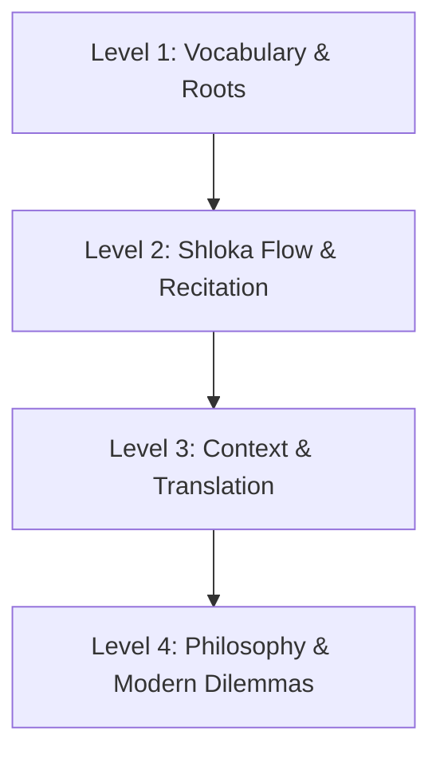

# 🕉️ GitaLingo: Duolingo-style Bhagavad Gita Quiz Engine & Database

A production-grade, pedagogically structured quiz database and learning engine designed to power a Duolingo-like interactive experience for the Bhagavad Gita.

---

## 🌟 Why This Architecture?

The database and generated exports cover all 18 chapters and 701 verse entries. This corpus follows the Vedic Scriptures API's numbering, which includes BG 13.1; some editions omit that opening question in Chapter 13 and therefore count 700 verses. New English verse translations are attributed to Swami Sivananda in the verse records. The public source API is intended for non-monetized apps; check the source terms before using the data in a commercial product.

Duolingo works because it breaks language learning into a progressive cognitive ramp rather than random trivia. This system divides each Shloka into **10 to 20 structured questions across 4 distinct learning levels**:



### 1. Level 1: Vocabulary & Word Mastery (4–5 Questions)
- **Match Pairs (`match_pairs`)**: Interactive tile matching connecting Sanskrit root words with English meanings.
- **Direct Vocabulary MCQ (`mcq_vocab`)**: Identify the meaning of key Sanskrit words from the shloka.
- **Reverse Vocabulary MCQ (`mcq_reverse_vocab`)**: Given an English meaning, pick the corresponding Sanskrit term.
- **Transliteration Match (`transliteration_match`)**: Connect Devanagari script with Roman IAST transliteration.

### 2. Level 2: Shloka Structure & Sacred Recitation (3–4 Questions)
- **Anushtubh Cloze Test - Line 1 (`fill_blank`)**: Fill in the missing Sanskrit word from the first quarter/half.
- **Anushtubh Cloze Test - Line 2 (`fill_blank`)**: Fill in the rhyming or concluding word of the verse.
- **Duolingo Word Jumble (`word_order`)**: Tap Sanskrit words in their sacred order to reconstruct the shloka.

### 3. Level 3: Context & Meaning (3–4 Questions)
- **Speaker & Addressee (`speaker_context`)**: Who is speaking? (Dhritarashtra, Sanjaya, Arjuna, Sri Krishna) To whom? What is their emotional state?
- **Verse Translation Choice (`translation_mcq`)**: Distinguish authentic translations (Swami Sivananda, Gambhirananda) from plausible misconceptions.
- **True / False Comprehension (`true_false`)**: Verify core situational facts of the dialogue.

### 4. Level 4: Philosophy & Real-Life Dilemmas (4–5 Questions)
- **Deep Philosophical Insight (`philosophical_insight`)**: Commentary-level understanding (e.g., why Dhritarashtra separated *māmakāḥ* "my sons" from *pāṇḍavāḥ* "Pandu's sons").
- **Inner Battlefield Allegory (`metaphor`)**: Kurukshetra as the battlefield of the human mind and senses.
- **Modern Workplace & Ethical Scenarios (`life_scenario`)**: Duolingo story-style scenario where a student or leader applies the shloka's wisdom to a modern moral dilemma.
- **Actionable Takeaways (`takeaway`)**: The core mental habit or spiritual virtue to cultivate today.

---

## 📂 Project Structure

```
gita_duolingo/
├── app/                        # HTTP API and browser client
│   ├── api.py
│   └── web/index.html
├── database/                   # Local SQLite source database
│   └── gita_duolingo.db
├── data/                       # Authored curriculum and source overrides
├── docs/                       # Developer and data-model documentation
├── exports/                    # Generated JSON, SQL, and Prisma seed data
├── scripts/                    # Batch, export, import, and maintenance commands
├── src/gitalingo/              # Reusable Python data-generation package
├── cache/                      # Local API response cache (not committed)
├── README.md
└── requirements.txt
```

---

## 🚀 Quick Start Guide

### Thematic learning path for another application

`data/curriculum.json` is a portable, app-ready course organized into 10 thematic sections, from **Arjuna's Grief** and **The Eternal Soul** to **Choice and Surrender**. Each section includes an introduction, chapter and verse references, learning objectives, and three questions with options, correct answers, explanations, and difficulty. The course is authored independently of the verse-by-verse question bank, so it can be imported by another app even while more verse data is being added.

The API serves the same data at:

- `GET /api/curriculum` — complete course and questions
- `GET /api/sections` — ordered section metadata
- `GET /api/sections/{section_id}` — one section and its questions

Running `python scripts/export_db.py` also writes `exports/curriculum.json` for direct import. Questions use stable string IDs and a consistent `type`, `prompt`, `options`, `correct_answer`, `explanation`, `verse_reference`, and `difficulty` shape.

Verse records also include `meaning_en`, a generated 50-60 word learning explanation in addition to the source translation in `translation_en`. Run `python scripts/generate_meanings.py` to regenerate meanings and refresh the exports.

### Fetching uncached verse data

Run `python scripts/batch_runner.py --all-missing --batch-size 25` to fetch every missing verse in resumable batches. Existing verse JSON files in `cache/verses/` are reused. New verses come from the public [Vedic Scriptures Bhagavad Gita API](https://github.com/vedicscriptures/vedicscriptures.github.io); the English translation used for quiz generation is by Swami Sivananda. The API project identifies itself as MIT licensed and its endpoint is intended for non-monetized app use. Attribution should remain with redistributed data. Set `RAPIDAPI_KEY` only when you choose to use the original RapidAPI provider; never commit API keys.

### 1. View & Play the Duolingo Web App
Start the local server:
```bash
python -m app.api
```
Open your browser at:
- **Interactive Duolingo UI**: `http://127.0.0.1:8000/`
- **Interactive REST API Docs (Swagger)**: `http://127.0.0.1:8000/docs`

### 2. Generate More Verses & Chapters
To generate quiz questions for any chapter:
```bash
# Generate Chapter 1, verses 1 to 47:
python scripts/batch_runner.py --chapter 1 --start 1 --end 47

# Generate Chapter 2 (Transcendental Knowledge), verses 1 to 20:
python scripts/batch_runner.py --chapter 2 --start 1 --end 20
```

### 3. Export to Mobile App or PostgreSQL / Supabase
Run:
```bash
python scripts/export_db.py
```
This writes:
- `exports/gita_duolingo.sql` -> Paste into Supabase SQL Editor or `psql`
- `exports/gita_duolingo_bundle.json` -> Bundle directly in Flutter `assets/` or React Native

---

## 🗄️ Database Schema Reference

For application integration, MongoDB collection mapping, API endpoints, JSON shapes, and answer handling, see [docs/DEVELOPER_SCHEMA.md](docs/DEVELOPER_SCHEMA.md). The SQL DDL is maintained in `src/gitalingo/schema.py`.

The app-ready Prisma seed follows `Scripture → Chapter → Module → Lesson → Verse`: verses reference one lesson, and no chapter foreign key or verse join table is used in the app database. The local SQLite corpus retains source chapter grouping for content generation.

The Prisma content model seed export is generated with `python scripts/export_prisma_seed.py` and written to `exports/prisma_seed_content.json`. See the developer schema guide for the model mapping and the app-owned runtime data that is intentionally excluded.

### `chapters` Table
| Column | Type | Description |
|---|---|---|
| `chapter_number` | INTEGER PRIMARY KEY | 1 to 18 |
| `name_sanskrit` | TEXT | Sanskrit name (e.g., अर्जुनविषादयोग) |
| `name_transliterated` | TEXT | IAST transliteration |
| `name_meaning` | TEXT | English meaning |
| `verses_count` | INTEGER | Number of verses |

### `verses` Table
| Column | Type | Description |
|---|---|---|
| `verse_key` | TEXT PRIMARY KEY | e.g. "BG1.1" |
| `chapter_number` | INTEGER | Chapter number |
| `verse_number` | INTEGER | Verse number |
| `text_devanagari` | TEXT | Original verse in Devanagari script |
| `transliteration` | TEXT | Roman transliteration |
| `translation_en` | TEXT | Preferred English translation |
| `speaker` | TEXT | Speaker (Dhritarashtra, Arjuna, Krishna, Sanjaya) |

### `questions` Table (Quiz Core)
| Column | Type | Description |
|---|---|---|
| `id` | INTEGER PRIMARY KEY | Auto-incrementing ID |
| `verse_key` | TEXT | e.g. "BG1.1" |
| `lesson_level` | INTEGER | 1: Vocab, 2: Structure, 3: Context, 4: Life Application |
| `question_order` | INTEGER | 1 to 20 |
| `question_type` | TEXT | `match_pairs`, `mcq_vocab`, `fill_blank`, `word_order`, `life_scenario` |
| `instruction` | TEXT | UI instruction banner |
| `prompt` | TEXT | The question prompt |
| `prompt_sanskrit` | TEXT | Optional Sanskrit highlight snippet |
| `options_json` | TEXT | JSON array of choices or pair sets |
| `correct_answer_json` | TEXT | Correct choice, answer string, or matching dictionary |
| `explanation` | TEXT | Pedagogical and spiritual explanation |
| `xp_points` | INTEGER | 10 to 20 XP reward |
